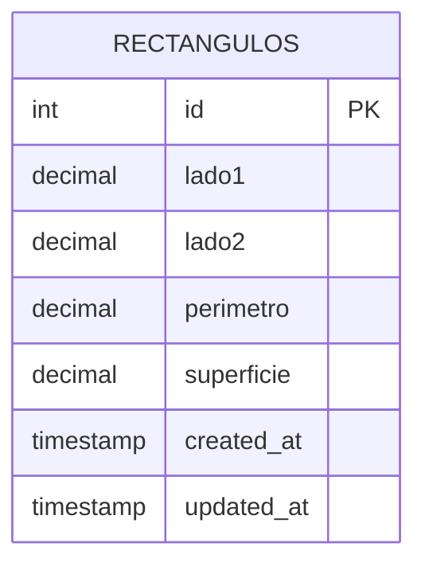

# Ejercicio 1: API REST Rectángulos

API RESTful con ExpressJS y MySQL para administrar rectángulos. Calcula perímetro y superficie en el servidor y valida solicitudes con express-validator.

---

## Estructura del proyecto

Ejercicio 1/
├── config/
│   └── db.js
├── controllers/
│   └── rectangulo.controller.js
├── middlewares/
│   └── validator.middleware.js
├── routes/
│   └── rectangulo.routes.js
├── validators/
│   └── rectangulo.validator.js
├── .env
├── .env.example
├── app.js
├── der.md
├── package-lock.json
├── package.json
├── pruebas.http
└── schema.sql

---

## Diagrama Entidad-Relación (DER)

---

## Instalación y ejecución

1. **Instalar dependencias:**
   npm install

2. **Crear base de datos:**
   Ejecutar el contenido de schema.sql en MySQL.

3. **Variables de entorno:**
   Crear el archivo .env basándose en .env.example y configurar credenciales.

4. **Iniciar servidor:**
   npm run dev

---

## Endpoints de la API

Base URL: http://localhost:3000/api/rectangulos

| Método | Endpoint | Descripción | Body / Params |
| --- | --- | --- | --- |
| GET | / | Listar rectángulos | Query opcional: limit, page |
| GET | /:id | Obtener rectángulo por ID | Param: id |
| POST | / | Crear rectángulo | Body: { "lado1": 10, "lado2": 5 } |
| PUT | /:id | Modificar rectángulo | Param: id, Body: { "lado1": 15, "lado2": 8 } |
| DELETE | /:id | Eliminar rectángulo | Param: id |

---

## Validaciones (express-validator)

* **Lados:** lado1 y lado2 son obligatorios y deben ser números mayores a 0.
* **Campos calculados:** Si el cliente intenta enviar perimetro o superficie, la API responde con 400 Bad Request.
* **Params y Query:** Se valida que :id sea un entero positivo. Parámetros opcionales como limit y page en la query también se validan como enteros positivos.

---

## Fundamentación de decisiones de diseño

### Modelo de Datos
* **Tipos de datos:** Se usa DECIMAL(10, 2) para evitar errores de redondeo de punto flotante en lados, perímetro y superficie.
* **Campos derivados:** perimetro y superficie se persisten en la tabla según consigna, calculándose exclusivamente en el backend antes de insertar o modificar.
* **Auditoría:** Se incluyen created_at y updated_at para registrar creaciones y modificaciones.

### API REST
* **Recursos:** Se utiliza /api/rectangulos en plural siguiendo convenciones REST.
* **Fórmulas aplicadas en el servidor:**
  * perimetro = 2 * (lado1 + lado2)
  * superficie = lado1 * lado2

---

## Pruebas
Las solicitudes HTTP para testear casos de éxito y de validación de errores se encuentran en el archivo pruebas.http.