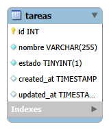
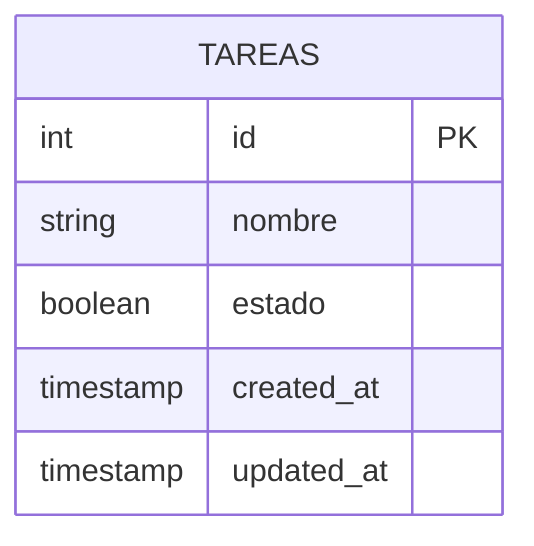

# Ejercicio 2: API REST para Lista de Tareas

API RESTful desarrollada con ExpressJS y MySQL para administrar tareas con validaciones de unicidad y estado.

---

## Estructura del proyecto

```text
Ejercicio 2/
├── config/
│   └── db.js
├── controllers/
│   └── tarea.controller.js
├── middlewares/
│   └── validator.middleware.js
├── routes/
│   └── tarea.routes.js
├── validators/
│   └── tarea.validator.js
├── .env
├── .env.example
├── .gitignore
├── database.sql
├── der.md
├── der.png
├── index.js
├── package.json
├── tareas.http
└── README.md
```

---

## Diagrama Entidad-Relación (DER)





---

## Instalación y ejecución

1. **Instalar dependencias:**
   ```bash
   npm install
   ```

2. **Crear base de datos:**
   Ejecutar `database.sql` en MySQL.

3. **Variables de entorno:**
   Configurar el archivo `.env` basándose en `.env.example`.

4. **Iniciar el servidor:**
   ```bash
   npm run dev
   ```

---

## Endpoints de la API

**Base URL:** `http://localhost:3000`

| Método | Endpoint | Descripción | Body / Params |
| --- | --- | --- | --- |
| **GET** | `/api/tareas` | Obtener tareas | Query opcional: `estado` (`completadas`, `pendientes`, `todas`) |
| **GET** | `/api/tareas/:id` | Obtener tarea por ID | Param: `id` |
| **POST** | `/api/tareas` | Crear tarea | Body: `{ "nombre": "Texto", "estado": false }` |
| **PUT** | `/api/tareas/:id` | Actualizar tarea | Param: `id`, Body: `{ "nombre": "Texto", "estado": true }` |
| **DELETE** | `/api/tareas/:id` | Eliminar tarea | Param: `id` |

---

## Validaciones (`express-validator`)

* **Unicidad:** Compara mediante `TRIM(LOWER(nombre))` impidiendo la creación de tareas con nombres equivalentes.
* **Estado:** Valida que sea un booleano válido (`true` o `false`).
* **Filtros:** Valida que el parámetro de consulta `estado` pertenezca a los valores admitidos (`completadas`, `pendientes`, `todas`).
* **IDs:** Valida que los parámetros de ruta sean números enteros positivos.

---

## Fundamentación de decisiones de diseño

### Modelo de Datos
* **Unicidad de Nombre:** Se aplica una comparación case-insensitive y se eliminan espacios redundantes antes de consultar o persistir datos en la base de datos.
* **Estado Booleano:** Se utiliza un tipo de dato booleano en la base de datos (`TINYINT(1)`) para optimizar el almacenamiento y facilitar el filtrado de estados pendientes y completados.

---

## Pruebas
Las pruebas de la API se pueden ejecutar con la extensión REST Client mediante el archivo `tareas.http`.