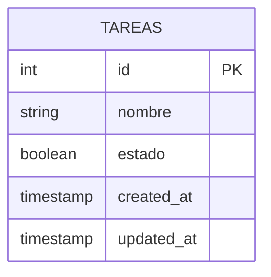

# Diagrama Entidad-Relación (DER) - Ejercicio 2

## Decisiones de Diseño y Fundamentación

### Modelo de Datos
- **Unicidad de Nombre**: Se aplica el criterio `TRIM(LOWER(nombre))` para evitar tareas duplicadas independientemente de espacios adicionales o variantes de mayúsculas/minúsculas.
- **Campo Estado**: Representa un tipo booleano (`BOOLEAN` / `TINYINT(1)`) donde `false` indica pendiente y `true` indica completada.
- **Trazabilidad**: Se incorporan campos `created_at` y `updated_at`.

### API REST
- **Recursos**: `/api/tareas` en plural.
- **Filtrado**: Parámetro de consulta `?estado=completadas|pendientes|todas`.
