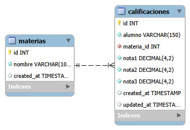
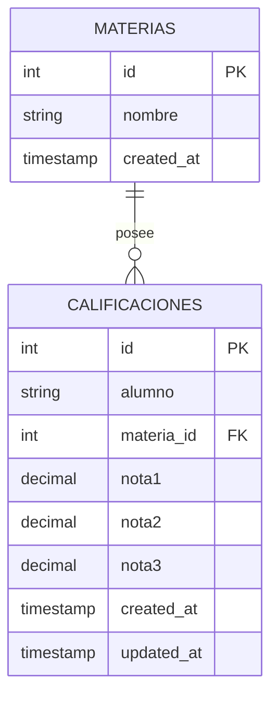

# Ejercicio 3: API REST para Gestión de Calificaciones

API RESTful desarrollada en ExpressJS y MySQL para administrar calificaciones universitarias con validación de materias y notas en escala de 1 a 10.

---

## Estructura del proyecto

```text
Ejercicio 3/
├── config/
│   └── db.js
├── controllers/
│   ├── calificacion.controller.js
│   └── materia.controller.js
├── middlewares/
│   └── validator.middleware.js
├── routes/
│   ├── calificacion.routes.js
│   └── materia.routes.js
├── validators/
│   └── calificacion.validator.js
├── .env
├── .env.example
├── calificaciones.http
├── database.sql
├── der.md
├── der.png
├── index.js
├── package.json
└── README.md
```

---

## Diagrama Entidad-Relación (DER)





---

## Escala de Calificaciones
- **Escala aprobada**: Rango continuo de **1.0 a 10.0**.
- **Regla de 3 Notas**: Cada registro debe contar obligatoriamente con `nota1`, `nota2` y `nota3`.

---

## Instalación y Ejecución

1. **Instalar dependencias:**
   ```bash
   npm install
   ```

2. **Cargar Base de Datos:**
   Ejecutar el script `database.sql` en MySQL.

3. **Configurar entorno:**
   Completar el archivo `.env` basándose en `.env.example`.

4. **Iniciar servidor:**
   ```bash
   npm run dev
   ```

---

## Endpoints de la API

**Base URL:** `http://localhost:3000`

| Método | Endpoint | Descripción | Body / Params / Query |
| --- | --- | --- | --- |
| **GET** | `/api/calificaciones` | Obtener todas las calificaciones | Query opcional: `materia_id`, `alumno` |
| **GET** | `/api/calificaciones/:id` | Obtener calificación por ID | Param: `id` |
| **POST** | `/api/calificaciones` | Registrar calificaciones | Body: `{ "alumno", "materia_id", "nota1", "nota2", "nota3" }` |
| **PUT** | `/api/calificaciones/:id` | Actualizar registro | Param: `id`, Body completo |
| **DELETE** | `/api/calificaciones/:id` | Eliminar registro | Param: `id` |
| **GET** | `/api/materias` | Listar materias registradas | N/A |