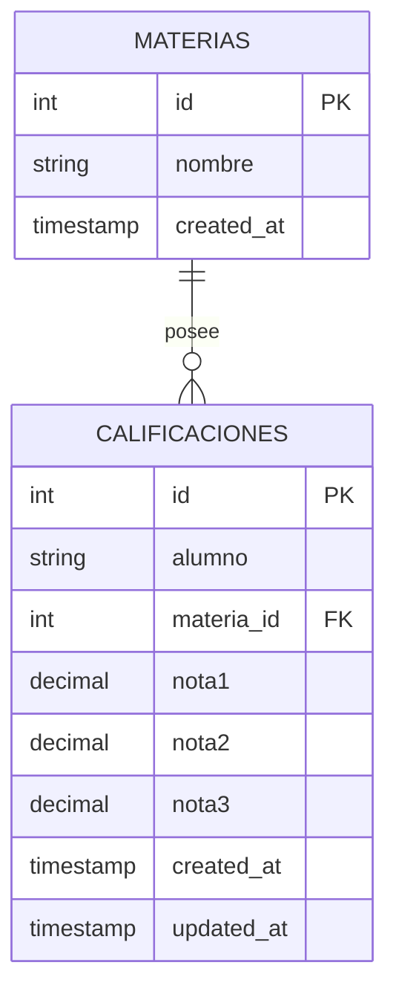

# Diagrama Entidad-Relación (DER) - Ejercicio 3

## Fundamentación y Decisiones de Diseño

### Escala de Calificaciones
- **Rango**: De **1.00 a 10.00** con soporte para valores decimales.
- **Validación**: Se valida mediante `isFloat({ min: 1, max: 10 })` en `express-validator`.

### Modelo de Datos
- **Relación mediante Foreign Key**: La tabla `calificaciones` referencia a `materias(id)` asegurando la integridad referencial.
- **Unicidad Alumno-Materia**: Se restringe la duplicación mediante una clave única combinada `UNIQUE KEY (alumno, materia_id)` y validación dinámica case-insensitive (`TRIM(LOWER(alumno))`).
- **Promedio**: Se calcula dinámicamente en el servidor en las consultas GET para mantener un modelo normalizado sin redundancia de datos.